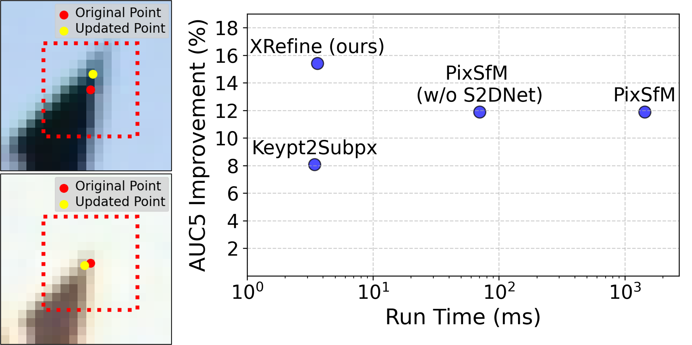

<!--
In order to view this readme, you can open the repository with Visual Studio Code, right click on README.md and select Open Preview.
-->

<p align="center">
  <h1 align="center"> XRefine: Attention-Guided Keypoint Match Refinement</h1>
  <h2 align="center"><p>
    <a href="TODO" align="center">[Project Page (TODO)]</a> |
    <a href="TODO" align="center">[ArXiv (TODO)]</a>
  </p></h2>
  <div align="center"></div>
</p>
<p align="center">
    
    <br>
    <em><b>XRefine</b> efficiently improves relative pose estimation. <b>Left:</b> Exemplary matched SuperPoint keypoints. The input to our model are the 11x11 patches within the red dotted lines. The refined keypoints of our model are presented as yellow dots. <b>Right:</b> Runtime and pose estimation improvement on MegaDepth (measured as relative increase in AUC5) of match refinement approaches averaged over five feature extractors: DeDoDe, SIFT, SuperPoint, and XFeat. We compare our generalizing model to <a href="https://github.com/KimSinjeong/keypt2subpx" align="center">Keypt2Subpx</a> and the match refinement solution of <a href="https://github.com/cvg/pixel-perfect-sfm" align="center">PixSfM</a>. PixSfM extracts dense S2DNet embeddings for feature-metric refinement. Depending on the use case this might be done exclusively for the refinement. Accordingly, we show the runtime of PixSfM with and without S2DNet inference.</em>
</p>

## Using this repository
### Obtain submodule
```bash
git clone --recurse-submodules https://github.com/cvg/glue-factory.git submodules/glue_factory
```

### Conda environment
To create the 'xrefine' conda environment, run:
```bash
conda env create -f conda_environment.yml
conda activate xrefine
# Install torch
pip install torch==2.7.0 torchvision==0.22.0 --index-url https://download.pytorch.org/whl/cu118
# Install Glue Factory (https://github.com/cvg/glue-factory)
cd submodules/glue_factory
python -m pip install -e .
cd ../../
# Install pygcransac
pip install pygcransac
```

### Demo
You can find the demo notebook [here](demo.ipynb). It applies the XRefine general model to refine sampled XFeat matches. 

### Create datasets
You can use the following scripts to prepare the datasets that are required as input for training and evaluation: 
- [scripts/create_train_datasets_general.sh](scripts/create_train_datasets_general.sh) for the general (non detector-specific) training dataset (~527 GB)
- [scripts/create_train_datasets_specific.sh](scripts/create_train_datasets_specific.sh) for the detector-specific training datasets (~200-300 GB per dataset)
- [scripts/create_eval_datasets_for_mega.sh](scripts/create_eval_datasets_for_mega.sh) for the MegaDepth evaluation datasets  (~60-250 GB per dataset)
- [scripts/create_val_datasets_for_mega.sh](scripts/create_val_datasets_for_mega.sh) for the MegaDepth1500 validation datasets  (~2-17 GB per dataset)

The scripts create_train_datasets_specific.sh, create_eval_datasets_for_mega.sh, and create_val_datasets_for_mega.sh will create corresponding datasets for certain detector+matcher combinations (MNN stands for Mutual Nearest Neighbor matching, and LG for LightGlue matching) XFeat+MNN, XFeat*+MNN, SIFT+MNN, DISK+LG, SuperPoint+MNN, SuperPoint+LG, ALIKED+LG.

For example, to train XRefine general, adapt scripts/create_train_datasets_general.sh to your needs, e.g. change output_directory. Be aware that GlueFactory will internally download MegaDepth (~440 GB). Now, execute:
```bash
./scripts/create_train_datasets_general.sh
```

### Training
To train XRefine general, adapt [scripts/train_xrefine_general.sh](scripts/train_xrefine_general.sh) to your needs, e.g. change data_dir if you previously changed the output_directory for the training dataset. Now, execute:
```bash
./scripts/train_xrefine_general.sh
```

### Evaluation
You can use the following scripts for evaluation of xrefine:
- [scripts/eval_xrefine_general_on_mega.sh](scripts/eval_xrefine_general_on_mega.sh) to evaluate XRefine general for varying detector+matcher combinations on MegaDepth 
- [scripts/eval_xrefine_specific_on_mega.sh](scripts/eval_xrefine_specific_on_mega.sh) to evaluate XRefine specific for varying detector+matcher combinations on MegaDepth 

Per default, the scripts use our pre-trained weights and assume the evaluation data to be located at processed_data/only_eval. Adapt the scripts to your needs and execute:
```bash
./scripts/eval_xrefine_general_on_mega.sh
```

## Citation
TODO

## License

This project is open-sourced under the AGPL-3.0 license. See the [LICENSE](LICENSE) file for details.

For a list of other open source components included in this project, see the file [3rd-party-licenses.txt](3rd-party-licenses.txt).

## Purpose of the project

This software is a research prototype, solely developed for and published as part of the publication cited above. 

## Contact

Please feel free to open an issue or contact personally if you have questions. Don't hesitate to write an email to the following email address:
JanFabian.Schmid@de.bosch.com

## Acknowledgement
This repository is based on [keypt2subpx](https://github.com/KimSinjeong/keypt2subpx).